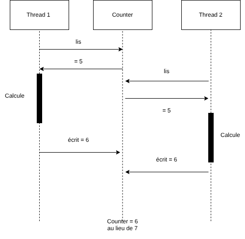
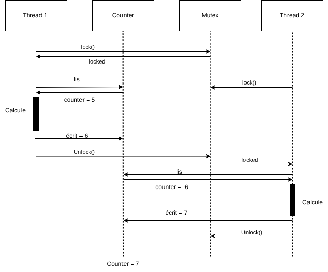

# Labo Processus — Semaine 03

## [processus] Empreinte mémoire d'un processus

Chaque processus a un espace mémoire **isolé** géré par la MMU, divisé en segments :

| Segment | Accès | Rôle |
|:-----------|:--------|:----------------------------------------------------------|
| `.text` | `r-x` | code exécutable |
| `.data` | `rw-` | variables globales initialisées |
| `.bss` | `rw-` | variables globales non initialisées |
| `.heap` | `rw-` | allocation dynamique (croît vers le haut) |
| `.stack` | `rw-` | pile d'appels (croît vers le bas) |

Seul `.text` est exécutable. L'**ASLR** randomise les adresses à chaque exécution pour contrer les attaques par débordement de tampon.

## [processus] Table de processus et PCB

Le **Process Control Block (PCB)** est la structure interne du noyau qui décrit chaque processus :

- `pid` — identifiant unique du processus
- `ppid` — identifiant du processus parent
- `state` — état courant (prêt, en exécution, bloqué…)
- `priority` — priorité de planification

## [processus] Inspection avec /proc

Le système de fichiers `/proc` expose l'état de chaque processus en temps réel.

**Trouver le PID :**
```bash
pidof hello
ps aux | grep hello
```

**Fichiers utiles dans `/proc/<pid>` :**

| Fichier | Contenu |
|:----------|:----------------------------------------------------------|
| `maps` | cartographie mémoire : adresses, permissions, bibliothèques |
| `status` | état, PID/PPID, mémoire (`VmRSS`), signaux |
| `cmdline` | ligne de commande utilisée au lancement |
| `stat` | statistiques brutes (CPU, priorité, pointeur de pile…) |

```bash
cat /proc/$(pidof hello)/maps
cat /proc/$(pidof hello)/status
```

## [processus] Variables d'environnement

Les variables d'environnement sont héritées par `fork()` et transmises à travers `exec()`.

```cpp
// env.cpp
#include <cstdlib>
#include <unistd.h>
#include <sys/wait.h>

int main() {
    setenv("FOOBAR", "qux", 1);   // ajout avant fork

    if (fork() == 0) {
        execl("/usr/bin/env", "env", (char *)NULL);  // affiche tout l'environnement
        exit(1);
    }
    wait(nullptr);
}
```

`FOOBAR=qux` apparaît dans la sortie de l'enfant — la variable a bien été héritée.

## [processus] États des processus et gestion des zombies

### États (`ps -l`)

| État | Nom | Description |
|:------|:----------------|:----------------------------------------------------------|
| R | Running | en exécution ou prêt |
| S | Sleeping | en attente d'un événement |
| D | Uninterruptible | attente d'E/S bloquante |
| T | Stopped | arrêté (`SIGSTOP`) |
| Z | Zombie | terminé, statut non récupéré par le parent |
| I | Idle | tâche noyau inactive |

### Orphelins et zombies

- **Orphelin** : le parent meurt avant l'enfant → l'enfant est réadopté par PID 1 (`systemd`)
- **Zombie** : l'enfant termine mais le parent n'appelle pas `wait()` → l'entrée reste dans la table

```cpp
// wait.cpp — éviter les zombies
#include <unistd.h>
#include <sys/wait.h>
#include <iostream>

int main() {
    if (fork() == 0) {
        sleep(5);
    } else {
        wait(nullptr);  // attend l'enfant → pas de zombie
    }
}
```

## [processus] Pipes — usages avancés

### Pipes anonymes (shell)

```bash
ls -l | grep '^d' | wc -l   # compter les répertoires
find . -name "*.cpp" | xargs grep 'cout' | wc -l
```

Les pipes `|` sont anonymes : créés par le shell, ils relient stdout → stdin entre processus.

### Pipes nommés (FIFO)

```bash
mkfifo mypipe       # crée un fichier spécial (type 'p')
ls -l mypipe        # → prw-r--r--
cat > mypipe        # bloque jusqu'à ce qu'un lecteur se connecte
```

FIFO = First In First Out. **Bloquant** : l'écriture attend un lecteur, et vice versa.

### En C

```cpp
// pipe.cpp
#include <stdio.h>
#include <unistd.h>
#include <string.h>

int main(void) {
    int fds[2];
    pipe(fds);

    if (fork() == 0) {
        close(fds[1]);                        // enfant : ferme l'écriture
        char buf[30] = {0};
        size_t n = read(fds[0], buf, sizeof(buf));
        printf("Lu %ld octets : %s\n", n, buf);
        close(fds[0]);
    } else {
        close(fds[0]);                        // parent : ferme la lecture
        const char *msg = "Salut du parent!";
        write(fds[1], msg, strlen(msg));
        close(fds[1]);
    }
}
```

Toujours fermer l'extrémité inutilisée pour éviter les fuites et garantir `EOF` correct.

## [processus] Signaux — gestionnaires pratiques

```cpp
// signal.cpp
#include <iostream>
#include <csignal>
#include <unistd.h>

void handle_sigusr1(int) { std::cout << "SIGUSR1 reçu\n"; }
void handle_sigusr2(int) { std::cout << "SIGUSR2 reçu\n"; }

int main() {
    signal(SIGUSR1, handle_sigusr1);
    signal(SIGUSR2, handle_sigusr2);
    std::cout << "PID : " << getpid() << "\n";
    while (true) pause();
}
```

```bash
kill -SIGUSR1 <pid>   # → SIGUSR1 reçu
kill -SIGKILL <pid>   # termine immédiatement, non interceptable
```

`SIGKILL` ne peut jamais être intercepté ni ignoré par le processus.

## [ipc] Mémoire partagée et sémaphores

10 processus enfants lisent une valeur en mémoire partagée sur réception de `SIGUSR1`.

```cpp
// fork10.cpp
#include <iostream>
#include <unistd.h>
#include <sys/wait.h>
#include <sys/shm.h>
#include <signal.h>
#include <vector>
#include <semaphore.h>

int* shm;
sem_t* sem;

void handler(int) {
    sem_wait(sem);
    std::cout << "PID " << getpid() << " lit : " << *shm << "\n";
    sem_post(sem);
}

int main() {
    shm = (int*)shmat(shmget(IPC_PRIVATE, sizeof(int), IPC_CREAT | 0666), nullptr, 0);
    sem = new sem_t;
    sem_init(sem, 1, 1);
    signal(SIGUSR1, handler);

    std::vector<pid_t> children;
    for (int i = 0; i < 10; ++i) {
        pid_t pid = fork();
        if (pid == 0) { while (true) pause(); exit(0); }
        children.push_back(pid);
    }

    while (true) {
        int val; std::cin >> val;
        sem_wait(sem); *shm = val; sem_post(sem);
        for (pid_t c : children) kill(c, SIGUSR1);
    }
}
```

Le **sémaphore** garantit qu'un seul processus à la fois accède à la mémoire partagée.

## [threads] Threads vs processus

| | Threads | Processus |
|:------------------------|:-------------------------------------|:-------------------------------------|
| Création | légère (`std::thread`) | coûteuse (`fork()` + `exec()`) |
| Mémoire | partagée (heap, globals, fds) | isolée (MMU, espace virtuel dédié) |
| Stack | privée par thread | privée par processus |
| Communication | directe (variables partagées) | IPC (pipes, shm, sockets…) |
| Synchronisation | mutex, condition\_variable, atomic | sémaphores POSIX, mmap partagé |
| Changement de contexte | rapide (même espace mémoire) | lent (flush TLB, changement CR3) |
| Crash | un thread plante tout le processus | un processus plante seul |
| Sécurité | faible (accès mémoire partagé) | forte (isolation par le noyau) |
| Débogage | difficile (races, deadlocks) | plus simple (isolation naturelle) |
| Identifiant | TID (`gettid()`) dans le même PID | PID distinct |

Quand utiliser quoi ?

- Threads : tâches fortement couplées qui partagent beaucoup de données (ex. serveur web, calcul parallèle sur une matrice).
- Processus : tâches indépendantes où l'isolation est critique (ex. workers d'un navigateur, micro-services).

## [exclusion-mutuelle] Race conditions et mutex

### Le problème

```cpp
// counter.cpp
#include <iostream>
#include <thread>
#include <vector>

size_t counter = 0;

struct Worker {
    size_t max = 1000000;
    void operator()() { for (size_t i = 0; i < max; ++i) ++counter; }
};

int main() {
    int n = std::thread::hardware_concurrency();
    std::vector<std::jthread> threads;
    Worker w;
    for (int i = 0; i < n; ++i) threads.emplace_back(w);
    for (auto& t : threads) t.join();
    std::cout << "Attendu : " << w.max * n << "\n";
    std::cout << "Obtenu  : " << counter << "\n";
}
```

Le résultat est **inférieur à la valeur attendue**. `++counter` n'est pas atomique :

```asm
mov rax, counter   ; 1. charger
add rax, 1         ; 2. incrémenter
mov counter, rax   ; 3. stocker
```

Deux threads peuvent charger la même valeur → un incrément est perdu.

{width=60% fig-pos="H"}

### La solution : mutex

```cpp
// mutex.cpp
#include <iostream>
#include <mutex>
#include <thread>
#include <vector>

size_t counter = 0;
std::mutex mtx;

struct Worker {
    size_t max = 1000000;
    void operator()() {
        for (size_t i = 0; i < max; ++i) {
            mtx.lock(); ++counter; mtx.unlock();
        }
    }
};

int main() {
    int n = std::thread::hardware_concurrency();
    std::vector<std::jthread> threads;
    Worker w;
    for (int i = 0; i < n; ++i) threads.emplace_back(w);
    for (auto& t : threads) t.join();
    std::cout << "Attendu : " << w.max * n << "\n";
    std::cout << "Obtenu  : " << counter << "\n";
}
```

{width=65% fig-pos="H"}

### Impact sur les performances

| Version | Résultat | Temps |
|:------------|:-----------------------------|:----------|
| Sans mutex | 2 386 340 / 20 000 000 | 0.129 s |
| Avec mutex | 20 000 000 / 20 000 000 | 10.022 s |

Le mutex est **~78× plus lent** mais garantit la cohérence. Pour un simple compteur, préférer `std::atomic<size_t>`.
