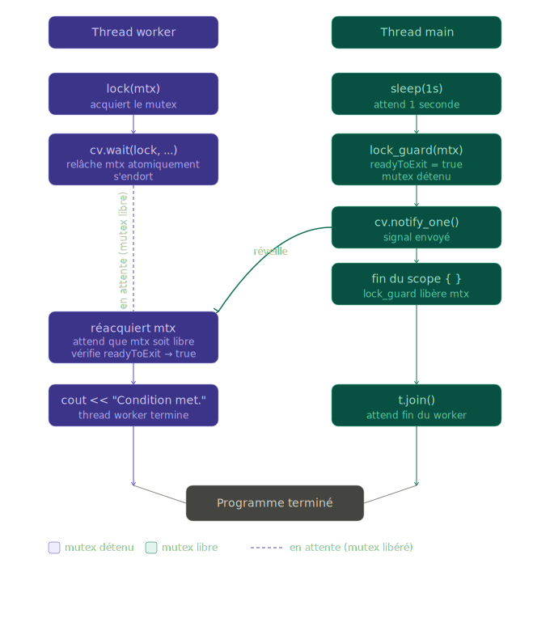

# Labo Processus — Semaine 04

## [threads] Signaux et threads

Un thread peut recevoir des signaux de son processus parent ou d'autres threads. Cependant, la gestion des signaux dans un programme multithread peut être complexe, car les signaux sont généralement délivrés à un processus entier et peuvent être traités par n'importe quel thread.

## [threads] Création de threads

### Création bas niveau en C++

Voici un programme qui permet de créer un thread en utilisant la fonction `clone()`, qui est une alternative plus bas niveau à `pthread_create()`. Le programme crée un thread qui exécute une tâche simple, tandis que le thread principal attend que le thread enfant termine. C'est une création bas niveau.


```cpp
#include <stdio.h>
#include <stdlib.h>
#include <unistd.h>
#include <iostream>
#include <sstream>

#define STACK_SIZE (1024 * 1024)

int func(void *task) {
    std::stringstream ss;
    for (int i = 3; i > 0; i--) {
        ss << "[thread] " << static_cast<char*>(task) << "(" << i << ")" << std::endl;
        std::cout << ss.str();
        sleep(1);
    }
    return 0;
}

int main() {
    bool error = false;

    // Reserve memory for the stack
    char *stack = static_cast<char*>(malloc(STACK_SIZE));
    if (stack == NULL) {
        perror("malloc");
        exit(EXIT_FAILURE);
    }

    // Create a new thread
    char *stackTop = stack + STACK_SIZE;  // stack grows downward
    const char* task = "Digging hole";
    pid_t pid = clone(func, stackTop,
        CLONE_VM /* Share memory space */ |
        CLONE_FS /* Share file system information */ |
        CLONE_FILES /* Share file descriptors */ |
        CLONE_SIGHAND /* Share signal handlers */ |
        CLONE_THREAD /* Create thread, not process */
        , static_cast<void*>(const_cast<char*>(task)));

    if (pid == -1) {
        perror("clone");
        error = true;
        goto error;
    }

    for (int i = 5; i > 0; i--) {
        std::stringstream ss;
        ss << "[main]   Waiting for task to finish" << std::endl;
        std::cout << ss.str();
        sleep(1);
    }

  error:
    free(stack);
    printf("Thread terminated\n");
    return error;
}
```

Il y a plusieurs problèmes dans ce code, notamment la boucle d'attente qui est une mauvaise pratique. Les bibliothèques C++ qui s'appuient sur `pthreads` utilisent un mécanisme de synchronisation pour attendre la fin d'un thread.

Si on réduit le temps dans la boucle principale, on va remarquer que le thread parent (main) va se terminer avant le thread enfant. Les threads vont être tués en même temps.

On remarque également que dans `htop`, les PID et les TGID sont les mêmes. 

Pour compiler ce programme, nous devons utiliser `-pthread`, cela est nécessaire pour lier la bibliothèque pthread qui est utilisée en interne par `clone()`. Sans cette option, le programme peut ne pas fonctionner correctement ou ne pas se compiler du tout.


#### Appels système du programme

La commande suivante permet d'observer les appels système effectués par un programme :

```bash
strace -f ./threadlow
```

L'option `-f` permet de suivre également les processus ou threads enfants créés par le programme.

| Appel système      | Rôle                                                              |
|:-------------------|:------------------------------------------------------------------|
| `execve`           | Lance l'exécution du programme. |
| `openat` / `read`  | Ouvre et lit les bibliothèques nécessaires au programme. |
| `mmap`             | Charge des fichiers ou réserve de la mémoire dans l'espace du processus. |
| `clone`            | Crée un nouveau thread dans le processus. |
| `write`            | Affiche du texte dans la sortie standard (terminal). |
| `clock_nanosleep`  | Met le thread en pause pendant un certain temps. |
| `futex`            | Sert à la synchronisation entre threads (mutex). |
| `exit` / `exit_group` | Termine un thread ou tout le programme. |

### Création bas niveau améliorée

Voici une version améliorée en utilisant `futex`

```cpp
#include <stdio.h>
#include <sys/syscall.h>
#include <stdlib.h>
#include <unistd.h>
#include <iostream>
#include <sstream>
#include <linux/futex.h>

#define STACK_SIZE (1024 * 1024)

volatile int futex_val = 0;

int func(void *task) {
    for (int i = 3; i > 0; i--) {
        std::stringstream ss;
        ss << "[thread] " << static_cast<char*>(task) << "(" << i << ")" << std::endl;
        std::cout << ss.str();
        sleep(1);
    }
    futex_val = 1;
    syscall(SYS_futex, &futex_val, FUTEX_WAKE, 1, NULL, NULL, 0);
    return 0;
}

int main() {
    bool error = false;

    // Reserve memory for the stack
    char *stack = static_cast<char*>(malloc(STACK_SIZE));
    if (stack == NULL) {
        perror("malloc");
        exit(EXIT_FAILURE);
    }

    // Create a new thread
    char *stackTop = stack + STACK_SIZE;  // stack grows downward
    const char* task = "Digging hole";
    pid_t pid = clone(func, stackTop,
        CLONE_VM | CLONE_FS | CLONE_FILES | CLONE_SIGHAND | CLONE_THREAD, static_cast<void*>(const_cast<char*>(task))
    );

    if (pid == -1) {
        perror("clone");
        error = true;
        goto error;
    }

    {
        std::stringstream ss;
        ss << "[main]   Waiting for task to finish" << std::endl;
        std::cout << ss.str();
        syscall(SYS_futex, &futex_val, FUTEX_WAIT, 0, NULL, NULL, 0);
    }

  error:
    free(stack);
    printf("Thread terminated\n");
    return error;
}
```
Dans ce programme, nous utilisons principalement `clone` pour créer un thread et `futex` pour la synchronisation entre le thread principal et le thread enfant.

Un futex (fast user-space mutex) est un mécanisme de synchronisation utilisé pour la gestion des threads. Il permet à un thread de se mettre en attente (wait) ou de réveiller (wake) d'autres threads de manière efficace, en minimisant les transitions entre l'espace utilisateur et le noyau.

Les futex sont spécifiques au noyau Linux et ne sont pas disponibles sous UNIX ou Windows. Sous Windows, des mécanismes de synchronisation tels que les mutex, les sémaphores et les événements sont utilisés à la place. Sous UNIX, des primitives de synchronisation comme les mutex POSIX et les sémaphores sont couramment utilisées.

### Création de thread avec `pthread`

Voici un exemple de création de thread en utilisant la bibliothèque `pthread` en C++.

```cpp

#include <stdio.h>
#include <stdlib.h>
#include <assert.h>
#include <pthread.h>
#include <unistd.h>

#define NUM_THREADS 5

void *worker(void *arguments) {
    int index = *((int *)arguments);
    int sleep_time = 1 + rand() % NUM_THREADS;
    printf("[thread %d] Started.\n", index);
    printf("[thread %d] Will be sleeping for %d seconds.\n", index, sleep_time);
    sleep(sleep_time);
    printf("Thread %d: Ended.\n", index);
    return NULL;
}

int main(void) {
  pthread_t threads[NUM_THREADS];
  int thread_args[NUM_THREADS];
  for (int i = 0; i < NUM_THREADS; i++) {
      printf("[main] Creating thread %d.\n", i);
      thread_args[i] = i;
      assert(!pthread_create(&threads[i], NULL, worker, &thread_args[i]));
  }

  printf("[main] All threads are created.\n");

  for (int i = 0; i < NUM_THREADS; i++) {
      assert(!pthread_join(threads[i], NULL));
      printf("[main] Thread %d has ended.\n", i);
  }

  printf("[main] Program has ended.\n");
}
```

Dans ce programme, les threads sont créés et gérés de manière plus structurée grâce à l'utilisation de la bibliothèque `pthread`. Les threads sont créés avec `pthread_create()`, qui gère automatiquement la création et la gestion des threads au niveau du système d'exploitation. De plus, le thread principal utilise `pthread_join()` pour attendre que chaque thread enfant se termine, ce qui garantit que le programme ne se termine pas avant que tous les threads aient fini leur travail.

Les appels système utilisés par `pthreads` pour créer et attendre les threads incluent :

| Appel | Rôle |
|---|---|
| `mmap(...MAP_STACK...)` | Alloue la pile du nouveau thread (~8 Mo) |
| `madvise(...MADV_GUARD_INSTALL)` | Protège la première page (guard page contre stack overflow) |
| `set_robust_list` | Initialise la liste des mutexes robustes du thread |
| `rseq` | Enregistre une séquence redémarrable (optimisation noyau) |
| `madvise(...MADV_DONTNEED)` | Libère la pile à la fin du thread |
| `exit(0)` | Termine le thread |

### Création de thread avec `std::thread`

Voici un exemple de création de thread en utilisant la bibliothèque `std::thread` en C++.

```cpp
#include <iostream>
#include <vector>
#include <thread>
#include <random>
#include <chrono>

constexpr int NUM_THREADS = 5;

void worker(int index) {
    std::random_device rd;
    std::mt19937 gen(rd());
    std::uniform_int_distribution<> distrib(1, NUM_THREADS);
    int sleep_time = distrib(gen);

    std::cout << "[thread " << index << "] Started.\n";
    std::cout << "[thread " << index << "] Will be sleeping for " << sleep_time << " seconds.\n";
    std::this_thread::sleep_for(std::chrono::seconds(sleep_time));
    std::cout << "Thread " << index << ": Ended.\n";
}

int main() {
    std::vector<std::thread> threads;

    for (int i = 0; i < NUM_THREADS; ++i) {
        std::cout << "[main] Creating thread " << i << ".\n";
        threads.emplace_back(worker, i);
    }

    std::cout << "[main] All threads are created.\n";

    for (auto& th : threads) {
        th.join();
        std::cout << "[main] Thread has ended.\n";
    }

    std::cout << "[main] Program has ended.\n";
}
```
Dans ce programme, nous utilisons `std::thread` pour créer et gérer les threads de manière encore plus simple et moderne. La bibliothèque `std::thread` fait partie de la bibliothèque standard C++11 et offre une interface de haut niveau pour la création et la gestion des threads.

La fonction `join()` est utilisée pour attendre la fin d'un thread. Lorsque `join()` est appelé sur un objet `std::thread`, le thread appelant (dans ce cas, le thread principal) se bloque jusqu'à ce que le thread associé à l'objet `std::thread` termine son exécution. Cela garantit que le programme ne se termine pas avant que tous les threads aient fini leur travail.

La fonction `worker` est exécutée par chaque thread, et elle utilise des fonctionnalités de la bibliothèque standard pour générer un temps de sommeil aléatoire et afficher des messages à la console. Il est du type de retour `void` car nous n'avons pas besoin de retourner une valeur à partir du thread.

Les appels système utilisés par `std::thread` sont similaires à ceux de `pthread`, car `std::thread` est généralement implémenté en utilisant `pthread` sous Linux.

### Création de thread en python

Voici un exemple de création de thread en utilisant la bibliothèque `threading` en Python.

```python
import threading
import time
import random

NUM_THREADS = 5

def worker(index):
    sleep_time = random.randint(1, NUM_THREADS)
    print(f"[thread {index}] Started.")
    print(f"[thread {index}] Will be sleeping for {sleep_time} seconds.")
    time.sleep(sleep_time)
    print(f"Thread {index}: Ended.")

if __name__ == "__main__":
    threads = []

    for i in range(NUM_THREADS):
        print(f"[main] Creating thread {i}.")
        thread = threading.Thread(target=worker, args=(i,))
        threads.append(thread)
        thread.start()

    print("[main] All threads are created.")

    for thread in threads:
        thread.join()
        print("[main] Thread has ended.")

    print("[main] Program has ended.")
```

Les deux utilisent `clone` avec les mêmes flags — Python passe par la même libc/libpthread sous le capot.

**Différence notable chez Python :** chaque thread appelle en plus `prctl(PR_SET_NAME, "Thread-1 (worke"...)` pour nommer le thread, et effectue des `mmap`/`munmap` supplémentaires pour allouer un espace mémoire dédié à l'interpréteur GIL.


+-------------------------+---------------------------------+------------------------------------------+
|                         | C++ (`pthread_join`)            | Python (`thread.join`)                   |
+=========================+=================================+==========================================+
| Appel principal         | `futex(FUTEX_WAIT_BITSET`       | `futex(FUTEX_WAIT_BITSET_PRIVATE`        |
|                         | `\| FUTEX_CLOCK_REALTIME)`      | `\| FUTEX_CLOCK_REALTIME)`               |
+-------------------------+---------------------------------+------------------------------------------+
| Mécanisme intermédiaire | Direct sur le `child_tid`       | Passe d'abord par une condition          |
|                         |                                 | variable interne Python                  |
|                         |                                 | (`FUTEX_WAIT_BITSET_PRIVATE` sur une     |
|                         |                                 | adresse différente) puis par le          |
|                         |                                 | `child_tid`                              |
+-------------------------+---------------------------------+------------------------------------------+
| Libération de la pile   | `munmap` de 8 Mo                | `munmap` seulement de 16 Ko              |
|                         | (toute la pile)                 | (le TLS Python) +                        |
|                         |                                 | `madvise MADV_DONTNEED` sur la pile      |
+-------------------------+---------------------------------+------------------------------------------+

En résumé, Python ajoute une couche d'indirection via ses propres primitives de synchronisation internes avant d'arriver au `futex` noyau.

En Python, `threading.Thread` attend une fonction `target` dont la **valeur de retour est ignorée**. Le thread ne dispose d'aucun mécanisme natif pour transmettre une valeur de retour au thread appelant (contrairement à `pthread_join` en C++ qui récupère le `void*`).

Donc même si `worker` retournait une valeur, elle serait silencieusement perdue. Par convention Python, une fonction qui ne retourne rien utile est annotée `-> None`, ce qui est cohérent avec l'usage dans un contexte threadé.

### Création de thread avec `std::jthread`

`std::jthread` est une version améliorée de `std::thread` apparue en C++20. Ce code fait la même chose que l'exemple avec `std::atomic<bool>`, mais de façon plus propre.

`stop_token` est un objet passé automatiquement par `jthread` au thread. Il permet au thread de savoir si on lui a demandé de s'arrêter, via `stop_requested()` qui retourne `true` quand l'arrêt a été demandé.

```cpp
void worker(std::stop_token stopToken) {
    while (!stopToken.stop_requested()) {
        std::this_thread::sleep_for(std::chrono::milliseconds(100));
        std::cout << "Work..." << std::endl;
    }
    std::cout << "Clean Stop." << std::endl;
}

int main() {
    std::jthread t(worker);
    std::this_thread::sleep_for(std::chrono::seconds(1));
}   // destructeur appelé → request_stop() + join() automatiques
```

Déroulement :
```
t=0s      jthread démarre, passe un stop_token à worker
t=0->1s    worker tourne, stop_requested() retourne false
t=1s      main() se termine, destructeur de jthread appelé
t=1s      jthread appelle request_stop() automatiquement
t=1s      stop_requested() retourne true, worker sort de la boucle
t=1s      worker affiche "Clean Stop."
t=1s      jthread attend la fin du thread (join automatique)
```

#### Avantages de `std::jthread`

- `join()` automatique à la destruction — impossible d'oublier et de provoquer un `std::terminate()`
- Mécanisme d'arrêt coopératif intégré via `stop_token` — pas besoin d'une variable `atomic<bool>` globale
- Code plus court, plus lisible, moins de risques d'erreurs

#### Apparition dans le standard

`std::jthread` est apparu en C++20. Il n'est pas disponible en C++17 ou avant.

#### Pourquoi pas `sleep()` ?

La fonction `std::this_thread::sleep_for()` est utilisée pour rester dans le standard C++ et pour éviter les problèmes de signal qui peuvent interrompre `sleep()`. De plus, `sleep_for` est plus flexible car il peut être utilisé avec différentes unités de temps (secondes, millisecondes, etc.) et peut être facilement combiné avec d'autres fonctions de la bibliothèque `<chrono>`.

```cpp
// durée relative : dort pendant X temps
std::this_thread::sleep_for(std::chrono::seconds(1));

// durée absolue : dort jusqu'à un moment précis
std::this_thread::sleep_until(std::chrono::steady_clock::now() + std::chrono::seconds(1));
```

`sleep_for` est la plus courante. `sleep_until` est utile quand on veut synchroniser sur une horloge précise plutôt que sur une durée.


## Cycle de vie d'un thread

### Le processus principal se termine avant le thread

Sans `join()`, le comportement est indéfini. Mais dans la pratique, le destructeur de `std::thread` lève une exception (`std::terminate`) si le thread est encore joinable au moment où il est détruit.
```cpp
int main() {
    std::thread t([]() {
        std::this_thread::sleep_for(std::chrono::seconds(5));
        std::cout << "Thread terminé" << std::endl;
    });

    std::cout << "Main terminé" << std::endl;
    return 0; // std::terminate() appelé, le thread t est encore joinable
}
```

Sortie :
```
Main terminé
terminate called without an active exception
Aborted (core dumped)
```

### Le thread se termine avant le processus principal

C'est le scénario idéal. Le thread finit son travail, libère ses ressources, et `main()` continue normalement. `join()` retourne immédiatement si le thread est déjà terminé.
```cpp
int main() {
    std::thread t([]() {
        std::cout << "Thread : travail rapide fait." << std::endl;
    });

    std::this_thread::sleep_for(std::chrono::seconds(2));
    std::cout << "Main : le thread est déjà terminé." << std::endl;

    t.join(); // retourne instantanément, le thread est déjà fini
    return 0;
}
```

Sortie :
```
Thread : travail rapide fait.
Main : le thread est déjà terminé.
```

Aucun risque — `join()` est non-bloquant si le thread a déjà terminé.


### Thread détaché (`detach()`) — processus principal termine en premier

Le thread détaché perd son lien avec `main()`, mais reste un enfant du processus. Quand le processus se termine, **tous ses threads sont tués immédiatement** par l'OS, qu'ils soient détachés ou non.
```cpp
int main() {
    std::thread t([]() {
        for (int i = 0; i < 5; i++) {
            std::this_thread::sleep_for(std::chrono::seconds(1));
            std::cout << "Thread : étape " << i << std::endl; // ← jamais affiché
        }
    });

    t.detach(); // plus de handle, le thread tourne "librement"
    std::cout << "Main : je termine." << std::endl;
    return 0;  // processus tué → thread détaché tué aussi
}
```

Sortie :
```
Main : je termine.
(le thread n'a pas le temps de s'exécuter)
```

### Tableau récapitulatif

| Scénario | Comportement | Risque |
|---|---|---|
| `main()` termine avant le thread, sans `join()` | `std::terminate()` | Critique |
| `main()` termine avant le thread, avec `join()` | `main()` attend proprement | Sûr |
| Thread termine avant `main()` | `join()` retourne instantanément | Sûr |
| Thread détaché, `main()` termine en premier | Thread tué par l'OS sans préavis | Données perdues |

Règle d'or : tout thread créé doit être soit `join()`-é, soit `detach()`-é avant la destruction de l'objet `std::thread` — et `detach()` ne doit être utilisé que si vous êtes certain que le thread n'accède pas à des ressources locales de `main()`.

## Arrêt coopératif d'un thread avec `std::atomic<bool>`

Voici un exemple de programme qui utilise une variable `std::atomic<bool>` pour signaler à un thread de s'arrêter de manière coopérative.

```cpp
#include <iostream>
#include <thread>
#include <atomic>

std::atomic<bool> keepRunning(true);

void worker() {
    while (keepRunning) {
        std::this_thread::sleep_for(std::chrono::milliseconds(100));
        std::cout << "Work..." << std::endl;
    }
    std::cout << "Clean Stop." << std::endl;
}

int main() {
    std::thread t(worker);
    std::this_thread::sleep_for(std::chrono::seconds(1));
    keepRunning = false;
    t.join();
}
```
`std::atomic<bool>` est utilisé pour garantir que les modifications à `keepRunning` sont visibles entre les threads sans nécessiter de mutex. Le thread `worker` vérifie régulièrement la valeur de `keepRunning` et s'arrête proprement lorsque celle-ci devient `false`.

`std::atomic` permet d'assurer la sécurité des données partagées entre les threads sans recourir à des mécanismes de verrouillage plus lourds. `std::mutex` ou `std::lock_guard` seraient nécessaires si nous avions besoin de protéger une section critique plus complexe, mais pour un simple flag d'arrêt, `std::atomic<bool>` est suffisant et plus performant.

## Attente conditionnelle avec `std::condition_variable`

Voici un exemple de programme qui utilise `std::condition_variable` pour synchroniser deux threads.

```cpp
#include <iostream>
#include <thread>
#include <mutex>
#include <condition_variable>

std::mutex mtx;
std::condition_variable cv;
bool readyToExit = false;

void worker() {
    std::unique_lock lock(mtx);
    cv.wait(lock, []{ return readyToExit; }); // Attente jusqu'à ce que readyToExit soit true

    std::cout << "Condition met." << std::endl;
}

int main() {
    std::thread t(worker);

    std::this_thread::sleep_for(std::chrono::seconds(1));
    // On ouvre un bloc d'accolades pour limiter la portée du lock
    {

        std::lock_guard<std::mutex> lock(mtx); // il verrouille le mutex à la création et le relâche à la destruction
        // mtx.lock(); // fonctionne aussi mais il ne faut pas oublier de le relâcher manuellement avec mtx.unlock()
        readyToExit = true;
        // mtx.unlock();

    } // déverrouille le mutex à la fin du scope
    cv.notify_one(); // Réveille le thread worker
    t.join();
}
```

### Shéma du fonctionnement de `std::condition_variable`

{width=60%}

### `std::unique_lock`

C'est un gestionnaire de mutex plus flexible que `lock_guard`. Il prend le mutex à sa création et le relâche à sa destruction, mais contrairement à `lock_guard`, il permet de relâcher et reprendre le mutex manuellement en cours de route.

```cpp
std::unique_lock<std::mutex> lock(mtx);  // prend le mutex
// section critique
lock.unlock();   // relâche manuellement
lock.lock();     // reprend
// à la destruction → relâche automatiquement si encore verrouillé
```

C'est obligatoire avec `condition_variable` car `cv.wait()` a besoin de relâcher le mutex pendant l'attente et le reprendre au réveil. `lock_guard` ne permet pas ça car il ne peut pas être relâché manuellement.

### `std::condition_variable`

C'est un mécanisme qui permet à un thread de s'endormir en attendant qu'une condition devienne vraie, et à un autre thread de le réveiller quand c'est le cas.

Il fonctionne toujours avec un mutex et une variable partagée qui représente la condition.

```cpp
std::mutex mtx;
std::condition_variable cv;
bool readyToExit = false;
```

Du côté du thread qui attend :

```cpp
std::unique_lock<std::mutex> lock(mtx); // prend le mutex
cv.wait(lock, []{ return readyToExit; });
// continue ici quand readyToExit == true
```

`cv.wait()` fait trois choses dans l'ordre : il relâche le mutex, endort le thread sans consommer de CPU, puis à chaque réveil reprend le mutex et vérifie la condition. Si la condition est encore fausse il se rendort, sinon il sort.

Du côté du thread qui notifie :

```cpp
{
    std::lock_guard<std::mutex> lock(mtx);
    readyToExit = true;
}// mutex relâché avant notify
cv.notify_one(); // Envoie un signal pour réveiller les threads en attente
```

`notify_one()` réveille un seul thread en attente. `notify_all()` les réveille tous, utile quand plusieurs threads attendent la même condition.

Le lambda passé à `cv.wait()` est indispensable pour se protéger des spurious wakeups — des réveils que le système peut déclencher spontanément sans qu'un `notify` ait été appelé. Sans lui, le thread pourrait sortir du wait alors que la condition est encore fausse.
