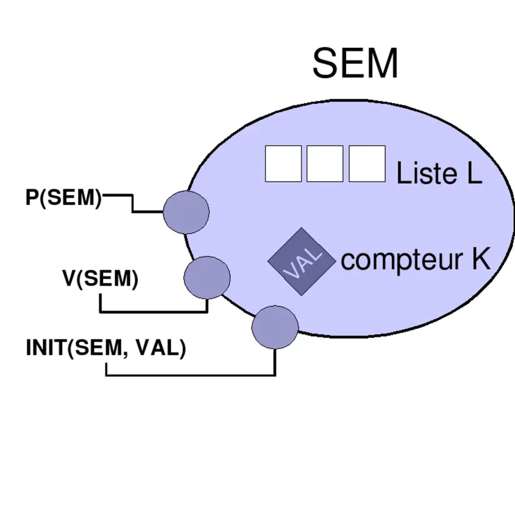

# Semaine 07 — 2026-03-31

## [semaphores] Sémaphores

Un sémaphore est un compteur utilisé pour contrôler l'accès à une ressource partagée dans un environnement concurrent. Il peut être utilisé pour résoudre des problèmes de synchronisation tels que les conditions de course et les interblocages.
Un sémaphore est composé d'un mutex, d'un compteur et d'une condition variable. Le mutex est utilisé pour protéger l'accès au compteur, tandis que la condition variable est utilisée pour faire attendre les processus lorsque le compteur est à zéro. Il a trois opérations : Proberen (P), Verhogen (V) et Initialiser (I). L'opération P décrémente le compteur, tandis que l'opération V l'incrémente. Si le compteur est à zéro, les processus qui tentent de décrémenter le compteur seront mis en attente jusqu'à ce qu'il soit supérieur à zéro.

{width=200px}


### Pourquoi deux sémaphores ? Le problème producteur-consommateur

Le problème producteur-consommateur est un problème classique de synchronisation dans lequel un producteur génère des données et les place dans une zone de stockage, tandis qu'un consommateur récupère ces données pour les traiter. Le défi est de s'assurer que le producteur ne place pas de données dans la zone de stockage lorsque celle-ci est pleine, et que le consommateur ne tente pas de récupérer des données lorsque la zone de stockage est vide.
Pour résoudre ce problème, on utilise généralement deux sémaphores : un sémaphore de comptage pour suivre le nombre d'éléments dans la zone de stockage, et un sémaphore binaire pour assurer l'exclusion mutuelle lors de l'accès à la zone de stockage. Le sémaphore de comptage est initialisé à zéro et est incrémenté par le producteur chaque fois qu'il ajoute un élément à la zone de stockage, et décrémenté par le consommateur chaque fois qu'il récupère un élément. Le sémaphore binaire est utilisé pour protéger l'accès à la zone de stockage afin d'éviter les conditions de course entre le producteur et le consommateur.

### Implémentation en C++
Voici une implémentation simple du problème producteur-consommateur en C++ utilisant des sémaphores :

```cpp
#include <semaphore.h>
#include <pthread.h>
#include <stdio.h>

#define FRIGO_MAX 12

sem_t places_libres;
sem_t bieres_dispo;

void* acheteur(void* arg) {
    while (1) {
        sem_wait(&places_libres); // -1 (Proberen)
        acheter_biere_au_landi();
        traverser_couloir();
        mettre_biere_dans_frigo();
        sem_post(&bieres_dispo); // +1 (Verhogen, signaler)
    }
    return NULL;
}
void* buveur(void* arg) {
    while (1) {
        sem_wait(&bieres_dispo); // -1 (Proberen, sonder)
        traverser_couloir();
        prendre_biere_dans_frigo();
        sem_post(&places_libres);
        boire_biere();
    }
    return NULL;
}

int main() {
    pthread_t t_acheteur, t_buveur;

    sem_init(&places_libres, 0, FRIGO_MAX);
    sem_init(&bieres_dispo,  0, 0);

    pthread_create(&t_acheteur, NULL, acheteur, NULL);
    pthread_create(&t_buveur,   NULL, buveur,   NULL);

    pthread_join(t_acheteur, NULL);
    pthread_join(t_buveur,   NULL);

    sem_destroy(&places_libres);
    sem_destroy(&bieres_dispo);

    return 0;
}
```

et avec semaphores C++20 :


ou variables conditionnelles :


### Test and set

Cette technique permet de vérifier et de modifier une variable atomiquement. Elle est souvent utilisée pour implémenter des verrous (locks) et des sémaphores. L'idée est de tester la valeur d'une variable et de la mettre à jour en une seule opération atomique, ce qui évite les conditions de course.