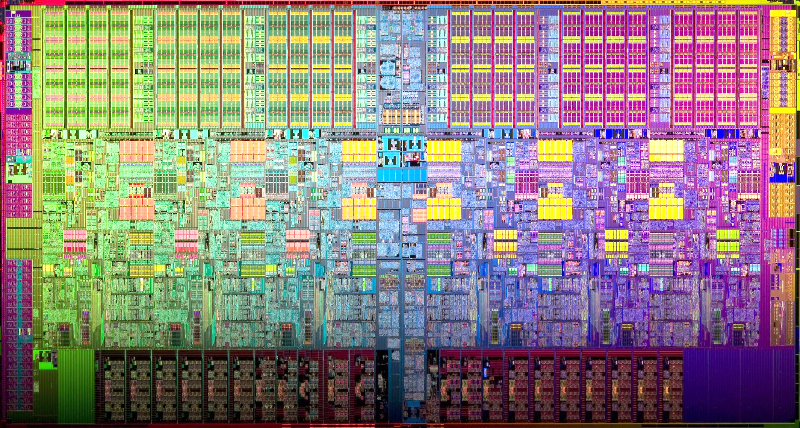

# Semaine 15 — 2026-06-02

## [async] Exemples d'utilisation de `std::async`

```cpp
#include <vector>
#include <iostream>
#include <cmath>
#include <future>
 
double compute(const std::vector<double>& data, size_t start, size_t end) {
    double sum = 0.;
    for (size_t i = start; i < end; ++i)
        sum += std::sqrt(data[i] * std::sin(data[i]));
    std::cout << "J'ai fini\n";
    return sum;
}
 
int main() {
    std::vector<double> data(10'000'000, 2.0);
    size_t half = data.size() / 2;
 
    std::future<double> f = std::async(std::launch::async, compute, std::cref(data), 0, half);
 
    double part_high = compute(data, half, data.size());
 
    std::cout << (f.get() + part_high) << "\n";
}
```
## [performance] Loi de Amdahl

La loi de Amdahl est une formule qui permet d'estimer le gain de performance d'un programme lorsqu'on parallélise une partie de son code. Elle s'exprime comme suit :

$$
\boxed{
S(n) = \frac{1}{(1 - P) + \frac{P}{n}}
}
$$

où :

- \(S(n)\) est le gain de performance avec \(n\) processeurs ou threads ;
- \(P\) est la proportion du programme qui est parallélisable ;
- \(1 - P\) est la partie qui reste séquentielle.

Par exemple, si 80% du code est parallélisable (\(P = 0.8\)) et 20% est séquentiel, alors le gain de performance avec 16 threads serait :

$$
S(16)
= \frac{1}{(1 - 0.8) + \frac{0.8}{16}}
= \frac{1}{0.2 + 0.05}
= 4
$$

Avec un nombre infini de threads, la partie parallélisable devient négligeable :

$$
S_{\max}
= \lim_{n \to \infty} S(n)
= \frac{1}{(1 - 0.8) + \frac{0.8}{\infty}}
= \frac{1}{0.2}
= 5
$$

La comparaison montre qu'avec 16 threads on obtient déjà un speedup de 4, mais que le maximum théorique reste limité à 5 à cause de la partie séquentielle. La loi de Amdahl souligne donc l'importance de minimiser la partie séquentielle d'un programme pour maximiser les gains de performance lors du parallélisme.


## [synchronisation] Barrières de synchronisation

Une Barrier est un mécanisme de synchronisation qui permet à un groupe de threads d'attendre que tous les membres du groupe atteignent un certain point d'exécution avant de continuer. C'est particulièrement utile dans les algorithmes parallèles où les threads doivent se synchroniser à des étapes spécifiques.

En C++20, la classe `std::barrier` fournit une implémentation de ce concept. Voici un exemple d'utilisation :

```cpp
#include <barrier>
#include <iostream>
#include <string>
#include <syncstream>
#include <thread>
#include <vector>
 
int main()
{
    const auto workers = {"Anil", "Busara", "Carl"};
 
    auto on_completion = []() noexcept
    {
        // locking not needed here
        static auto phase =
            "... done\n"
            "Cleaning up...\n";
        std::cout << phase;
        phase = "... done\n";
    };
 
    std::barrier sync_point(std::ssize(workers), on_completion);
 
    auto work = [&](std::string name)
    {
        std::string product = "  " + name + " worked\n";
        std::osyncstream(std::cout) << product;  // ok, op<< call is atomic
        sync_point.arrive_and_wait();
 
        product = "  " + name + " cleaned\n";
        std::osyncstream(std::cout) << product;
        sync_point.arrive_and_wait();
    };
 
    std::cout << "Starting...\n";
    std::vector<std::jthread> threads;
    threads.reserve(std::size(workers));
    for (auto const& worker : workers)
        threads.emplace_back(work, worker);
}
```

## [hardware] Anatomie d'un processeur multicœur

Un processeur moderne regroupe sur une même puce plusieurs **cœurs** d'exécution indépendants, capables de faire tourner des threads en parallèle. Chaque cœur possède ses caches privés (L1, L2), tandis qu'un grand **cache L3 partagé** sert de point de cohérence entre tous les cœurs. Autour des cœurs, l'« uncore » intègre les contrôleurs mémoire (DDR5), les liens d'E/S (PCIe, DMI/QPI, USB) et un agent système (gestion d'alimentation, capteurs de tension/température, horloges, contrôleur d'interruptions APIC).

{width=65%}

Schématiquement, l'organisation logique de la puce ressemble à ceci :

```{=latex}
\begin{center}
\begin{tikzpicture}[
  >=Latex, font=\small,
  core/.style={rectangle, draw, thick, rounded corners=2pt, fill=blue!12,
               minimum width=2.2cm, minimum height=1.0cm, align=center},
  l3/.style={rectangle, draw, thick, fill=green!15,
             minimum width=10cm, minimum height=0.8cm, align=center, font=\small\bfseries},
  io/.style={rectangle, draw, fill=orange!18,
             minimum width=1.9cm, minimum height=0.7cm, font=\scriptsize, align=center},
  sys/.style={rectangle, draw, fill=red!12,
              minimum width=1.45cm, minimum height=0.85cm, font=\scriptsize, align=center},
]
  % Contrôleurs mémoire et E/S (en haut)
  \foreach \name [count=\i from 0] in {DDR5 CH1, DDR5 CH2, {PCIe}, {DMI / QPI}, USB}{
    \node[io] at (\i*2.5, 4.3) {\name};
  }
  % Cœurs (rangée haute)
  \foreach \i in {0,1,2,3}{
    \node[core] (top\i) at (\i*2.7, 2.7) {Core \i\\[1pt]\scriptsize L2};
  }
  % Cache L3 partagé
  \node[l3] (l3) at (4.05, 1.5) {Cache L3 partagé};
  % Cœurs (rangée basse)
  \foreach \i/\n in {0/4,1/5,2/6,3/7}{
    \node[core] (bot\i) at (\i*2.7, 0.3) {Core \n\\[1pt]\scriptsize L2};
  }
  % Agent système (en bas)
  \foreach \txt [count=\i from 0] in {TPM, {Voltage\\monitor}, {Temp.\\monitor},
                                      {Gestion\\alim.}, {HPET\\(timer)},
                                      {TSC\\(timestamp)}, {APIC\\(IRQ)}}{
    \node[sys] at (\i*1.5, -1.4) {\txt};
  }
  % Connexions cœurs <-> L3
  \foreach \i in {0,1,2,3}{
    \draw[->] (top\i.south) -- (top\i.south|-l3.north);
    \draw[->] (bot\i.north) -- (bot\i.north|-l3.south);
  }
\end{tikzpicture}
\end{center}
```

C'est cette structure qui rend la programmation concurrente *réellement* parallèle : avec $N$ cœurs, jusqu'à $N$ threads progressent physiquement en même temps, ce qui donne tout son sens à la loi de Amdahl vue plus haut.

## [hardware] Microarchitecture d'un cœur

À l'intérieur d'un seul cœur, l'exécution est elle-même fortement parallélisée (parallélisme d'instructions, *ILP*). Le **frontend** récupère et décode les instructions, qui sont converties en micro-opérations. L'étage de **renommage** (ROB, RAT) permet l'exécution *dans le désordre* (out-of-order) tout en garantissant une terminaison ordonnée. Plusieurs **ports d'exécution** spécialisés (entiers, flottants/SIMD, accès mémoire) traitent ensuite les micro-opérations en parallèle.

```{=latex}
\begin{center}
\begin{tikzpicture}[
  >=Latex, font=\scriptsize,
  stg/.style={font=\small\bfseries, anchor=east},
  box/.style={rectangle, draw, rounded corners=1.5pt, minimum height=0.75cm, align=center},
  fe/.style={box, fill=blue!12},
  de/.style={box, fill=cyan!15},
  rn/.style={box, fill=violet!12},
  ie/.style={box, fill=green!13},
  fp/.style={box, fill=orange!15},
  me/.style={box, fill=red!12},
  ca/.style={box, fill=gray!18},
]
  % Frontend
  \node[fe, minimum width=2.4cm] (l1i) at (0,7)   {Cache L1\\instructions};
  \node[fe, minimum width=2.4cm] (bp)  at (2.6,7) {Branch\\Predictor};
  \node[fe, minimum width=2.4cm] (fu)  at (5.2,7) {Fetch Unit\\+ ITLB};
  \node[fe, minimum width=2.4cm] (opc) at (7.8,7) {Op-cache};
  \node[stg] at (-1.5,7) {Frontend};
  % Décodage
  \node[de, minimum width=3.1cm] (dec) at (0.4,5.6) {Decode Unit};
  \node[de, minimum width=3.1cm] (uqc) at (3.9,5.6) {Micro-op Cache};
  \node[de, minimum width=3.1cm] (uqq) at (7.4,5.6) {Micro-op Queue};
  \node[stg] at (-1.5,5.6) {Décodage};
  % Renommage
  \node[rn, minimum width=3.1cm] (rob) at (0.4,4.2) {ROB\\(Reorder Buffer)};
  \node[rn, minimum width=3.1cm] (rat) at (3.9,4.2) {RAT\\(Register Alias Table)};
  \node[rn, minimum width=3.1cm] (ret) at (7.4,4.2) {Retirement Unit};
  \node[stg] at (-1.5,4.2) {Renommage};
  % Exécution
  \node[ie, minimum width=3.0cm, minimum height=1.5cm] (intx) at (0.4,2.3)
        {\textbf{Scheduler entier}\\[2pt] 2$\times$ALU, 2$\times$AGU\\ BR};
  \node[fp, minimum width=3.0cm, minimum height=1.5cm] (fpx) at (3.9,2.3)
        {\textbf{Scheduler FP/SIMD}\\[2pt] FADD, FMUL\\ FMAC, F2I};
  \node[me, minimum width=3.0cm, minimum height=1.5cm] (mem) at (7.4,2.3)
        {\textbf{Load/Store}\\[2pt] LSQ\\ DTLB, AGU};
  \node[stg] at (-1.5,2.3) {Exécution};
  % Caches
  \node[ca, minimum width=4.6cm] (l1d) at (1.1,0.4) {Cache de données L1};
  \node[ca, minimum width=4.6cm] (l2)  at (6.6,0.4) {Cache L2};
  \node[stg] at (-1.5,0.4) {Caches};
  % Flux principal
  \draw[->] (fu.south)  -- (uqc.north);
  \draw[->] (dec.south) -- (rob.north);
  \draw[->] (rob.south) -- (intx.north);
  \draw[->] (rat.south) -- (fpx.north);
  \draw[->] (ret.south) -- (mem.north);
  \draw[<->] (intx.south) -- (l1d.north);
  \draw[<->] (mem.south)  -- (l2.north);
  \draw[<->] (l1d) -- (l2);
\end{tikzpicture}
\end{center}
```

Ce parallélisme matériel interne est invisible pour le programmeur, mais il explique pourquoi un même thread peut exécuter plusieurs instructions par cycle.